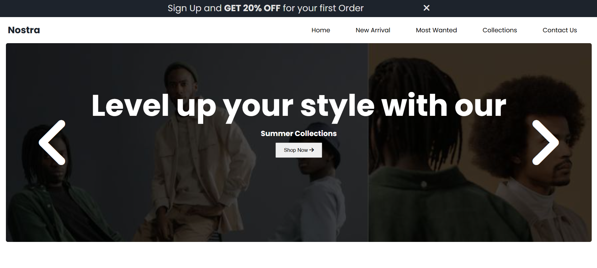
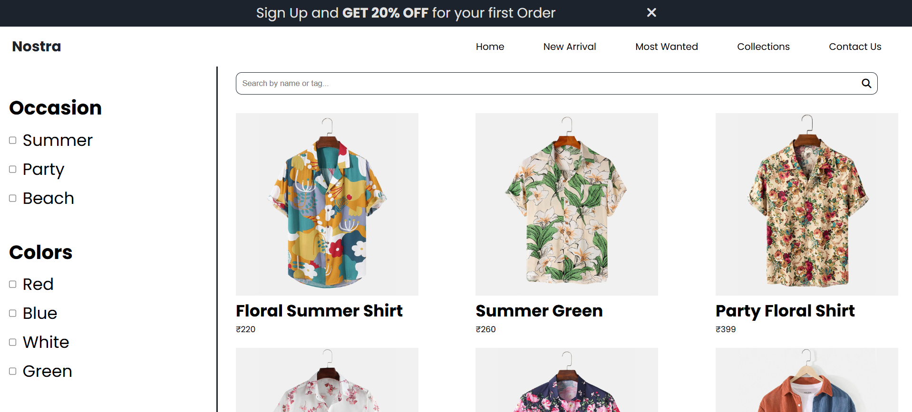
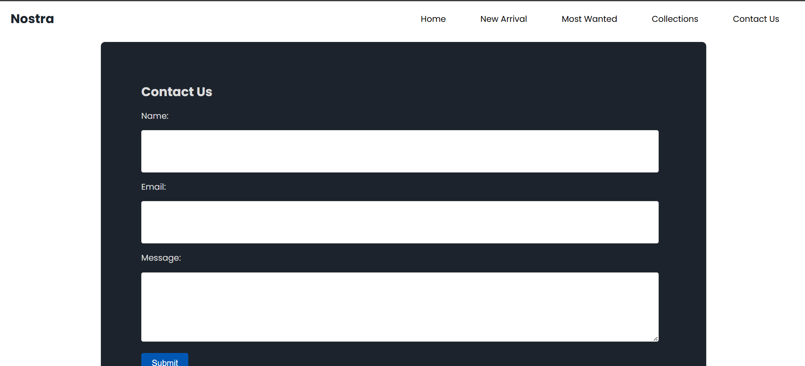

# 👗 Nostra – Fashion E-Commerce Website

**Nostra** is a modern **fashion e-commerce website** built with **HTML5, CSS3, and JavaScript**.  
It features responsive design, interactive sliders, product showcases, and smooth UI animations, making it a great foundation for an online clothing store.  

   

---

## 🔗 Live Demo  
👉 [Visit Nostra Live](<your-live-link>)  

## 📂 Repository  
👉 [GitHub Repo](https://github.com/Srinithish-dev-lab/Nostra-E-commerce)  

---

## ✨ Features

### 🏠 Home Page (`index.html`)
- Responsive Navbar & Sidebar** – works seamlessly on mobile and desktop  
- Implemented responsive design using media queries
- Added image slider and scroll animations with JavaScript
- Practiced positioning, flexbox, and layout styling

### 📂 Collections Page (`collections.html`) *(planned/exists)*
- Product filters (by price, occasion, color, arrivals)  
- Search bar to quickly find products  
- Flexible product grid layout  

### 📩 Contact Page (`contact.html`) *(planned/exists)*
- Contact form with **Name, Email, Message**  
- Styled with a modern responsive layout  

---

## 🛠️ Tech Stack

- **Frontend:** HTML5, CSS3  
- **Styling:** Custom CSS + Google Fonts + Font Awesome icons  
- **Interactivity:** Vanilla JavaScript (slider, sidebar, animations, wishlist toggle)  
- **Animations:** Scroll reveal effects, hover overlays  
- **Responsive Design:** Flexbox + Media Queries  

---

## 📸 Screenshots

### 🏠 Homepage

### 🛒 Collections Page

### 📩 Contact Page

---

